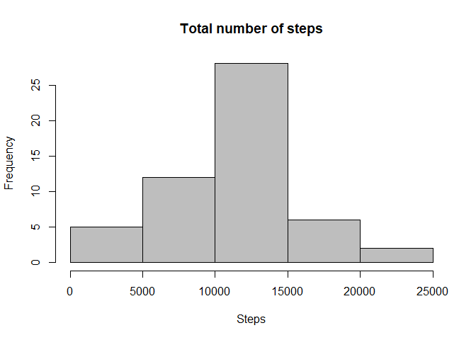
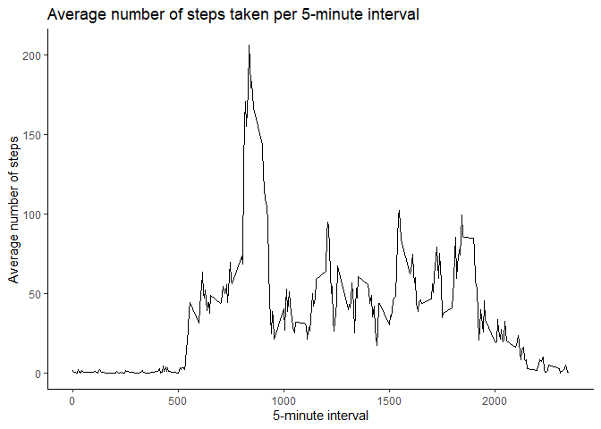
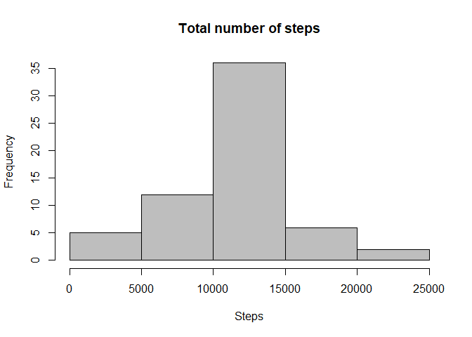
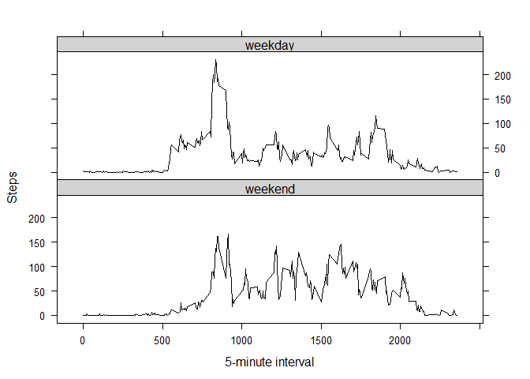

## Loading and preprocessing the data


```r
unzip("activity.zip")
data <- read.csv("activity.csv", sep=",")
data$Date <- as.Date(data$date,format = "%Y-%m-%d")
```

Calculate the total number of steps taken per day.


```r
totalsteps <- aggregate(steps ~ Date, data, sum)
#head(totalsteps,10)
```

Make a histogram of the total number of steps taken each day.


```r
hist(totalsteps$steps, main = "Total number of steps", xlab = "Steps", ylab = "Frequency", col = "grey")
```

<!-- -->

Calculate and report the mean and median of the total number of steps taken per day.


```r
mean(totalsteps$steps)
```

```
## [1] 10766.19
```

```r
median(totalsteps$steps)
```

```
## [1] 10765
```

## What is the average daily activity pattern?

Make a time series plot of the 5-minute interval (x-axis) and the average number of steps taken, averaged across all days (y-axis).


```r
intervalsteps <- aggregate(steps ~ interval, data, mean)
#head(intervalsteps,10)
library(ggplot2)
ggplot(intervalsteps, aes(interval, steps)) +
geom_line() +
theme_classic() +
labs(title = "Average number of steps taken per 5-minute interval", x = "5-minute interval", y = "Average number of steps")
```

<!-- -->

Which 5-minute interval, on average across all the days in the dataset, contains the maximum number of steps?


```r
intervalsteps[which.max(intervalsteps$steps),]
```

```
##     interval    steps
## 104      835 206.1698
```

## Imputing missing values

Calculate and report the total number of missing values in the dataset (i.e. the total number of rows with NAs).


```r
sum(is.na(data$steps))
```

```
## [1] 2304
```

Devise a strategy for filling in all of the missing values in the dataset. 
Please note that I use the mean for each 5-minute interval.

Create a new dataset that is equal to the original dataset but with the missing data filled in.


```r
newdata <- transform(data, steps = ifelse(is.na(data$steps), intervalsteps$steps[match(data$interval, intervalsteps$interval)], data$steps))
#head(newdata)
```

Make a histogram of the total number of steps taken each day.


```r
totalsteps2 <- aggregate(steps ~ Date, newdata, sum)

hist(totalsteps2$steps, main = "Total number of steps", xlab = "Steps", ylab = "Frequency", col = "grey")
```

<!-- -->

Calculate and report the mean and median total number of steps taken per day. Do these values differ from the estimates from the first part of the assignment? What is the impact of imputing missing data on the estimates of the total daily number of steps?


```r
mean(totalsteps2$steps)
```

```
## [1] 10766.19
```

```r
median(totalsteps2$steps)
```

```
## [1] 10766.19
```

After imputing missing data (using the average per 5-minute interval) the mean and median is 10766.19.  
The mean stays the same as before data imputation.  
The median is slightly different - it changed from 10765 to 10766.19.  

## Are there differences in activity patterns between weekdays and weekends?

Create a new factor variable in the dataset with two levels – “weekday” and “weekend” indicating whether a given date is a weekday or weekend day.


```r
daysofweek <- c('Monday', 'Tuesday', 'Wednesday', 'Thursday', 'Friday')
newdata$day <- factor((weekdays(newdata$Date) %in% daysofweek), 
         levels=c(FALSE, TRUE), labels=c('weekend', 'weekday'))
#head(newdata)
```

Make a panel plot containing a time series plot of the 5-minute interval (x-axis) and the average number of steps taken, averaged across all weekday days or weekend days (y-axis).


```r
intervalsteps2 <- aggregate(steps ~ interval + day, newdata, mean)
library(lattice)
xyplot(steps ~ interval | day, intervalsteps2, type = "l", layout = c(1, 2), 
    xlab = "5-minute interval", ylab = "Steps", col = "black",
    par.settings = list(strip.background=list(col="lightgrey")))
```

<!-- -->
